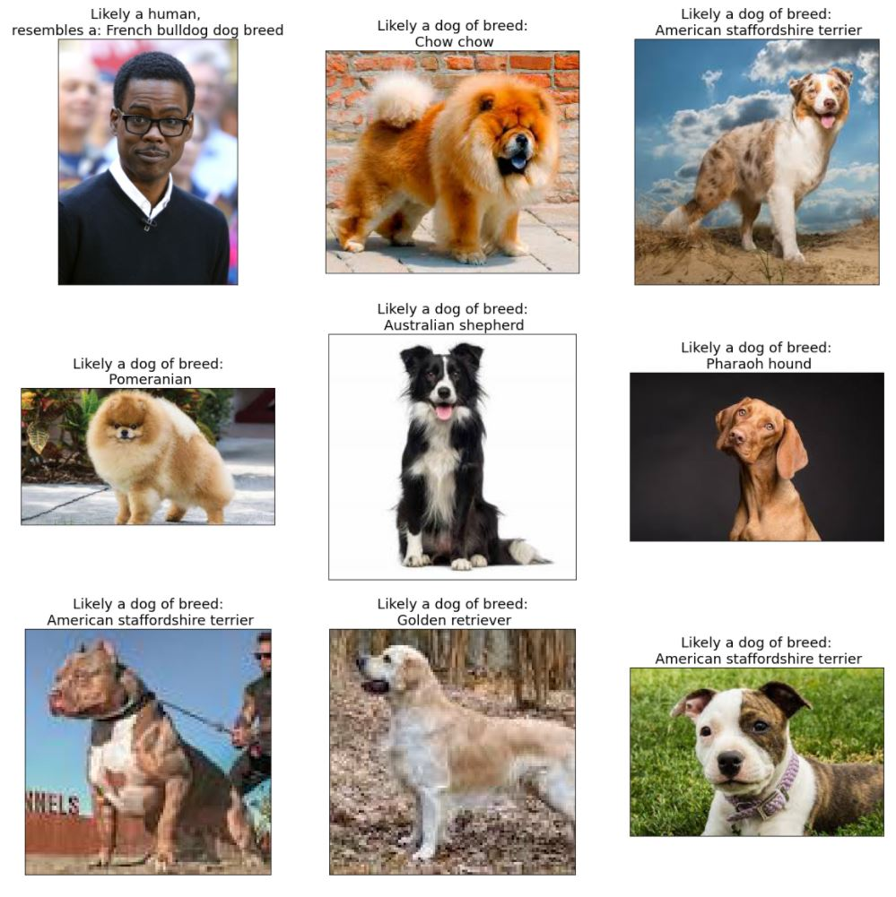

### Table of Contents

1. [Project Overview](#Overview)
3. [Project Motivation](#motivation)
2. [Installation Instruction](#installation)
3. [File Descriptions](#files)
4. [Sample Prediction Results](#results)
5. [Licensing, Author, Acknowledgement, References](#licensing)

## Project Overview

Computer vision is one of the major technological advances today - sitting at the the heart of processes/activities in various industries such as the automobile, medicine, security, communication, etc. In this project a Dog Breed classification system is developed using Convolutional Neural Networks.

## Project Motivation

This is one of the projects recommended for the Udacity Capstone Project for the award of a Nanodegree in Data Science. With a flair for computer vision and deeplearning, I Was particularly drawn to take on this project as a dog lover, with an end game in mind of developing this further into a mobile and web app.

## Installation Instruction

### Dependencies

- face_recognition==1.3.0
- ipython==8.0.1
- ipywidgets==7.6.3
- matplotlib==3.3.4
- numpy==1.19.2
- opencv_python==4.5.5.62
- Pillow==9.0.0
- torch==1.8.0
- torchvision==0.9.0
- tqdm==4.60.0

Face_recognition requires installation of dlib. Refer to this [link](https://medium.com/analytics-vidhya/how-to-install-dlib-library-for-python-in-windows-10-57348ba1117f) on how to install dlib and its dependencies
Info on Face recognition is located [here](https://face-recognition.readthedocs.io/en/latest/readme.html)

## File Descriptions 

The files neccessary to run the code are are below
1. dog_app_pytorch_SDA.ipnyb(file) - Main jupyter notebook file
2. haarcacades (folder) - contains OpenCV face recognition models
3. OptionalFaceDetector (folder) - contains OpenCV DNN model files
4. saved_models (folder) - contains optimal models saved after the various training steps in the notebooks
5. ./data/dog_images (folder)  - contains the training, validation and test dog image datasets
6. ./data/ifw (folder)  - contains human images.
7. blogpost.pdf - blog post document.
8. ./images(folder) - Contains images displayed in notebook and used to test the routine.

**NOTE**: Due to space limitations the data folder is hosted on my google drive [HERE](https://drive.google.com/drive/folders/1aHZcWOAUQGbjoQEgwh34FtjMQ3q89k65?usp=sharing)

**Steps to run the notebook:**
1. Create virtual environment for the notebook.
2. Install all dependencies.
3. Fork repository to disk drive
4. Get data.zip from my google [drive](https://drive.google.com/drive/folders/1aHZcWOAUQGbjoQEgwh34FtjMQ3q89k65?usp=sharing), and unzip it to the root of the directory were the repository files are placed.
5. Start jupyter notebook
6. Launch dog_app_pytorch_SDA.ipnyb and run all code cells. The last code cell will display a file select dialog that enables you select images for the algorithm to make predictions on.

## Sample Prediction Results

Sample predictions are shown below.

## Licensing, Author, Acknowledgement, References]

- Licencing: See license file
- Author: Success Attoni
- Acknowledgement: Credit to udacity for providing the boiler plate code and directions to complete this project.
- References.
	- Udacity Course Materials
	- https://pytorch.org/hub/pytorch_vision_vgg/
	- Face Detection – OpenCV, Dlib and Deep Learning ( C++ / Python ) = https://datahacker.rs/017-face-detection-algorithms-comparison/
	- dlib : https://learnopencv.com/face-detection-opencv-dlib-and-deep-learning-c-python/
	- Stackover flow posts: https://stackoverflow.com/
	- Medium Posts: https://towardsdatascience.com/

